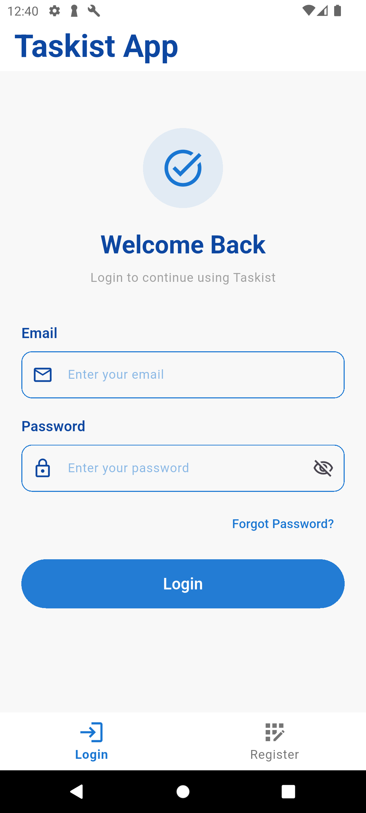
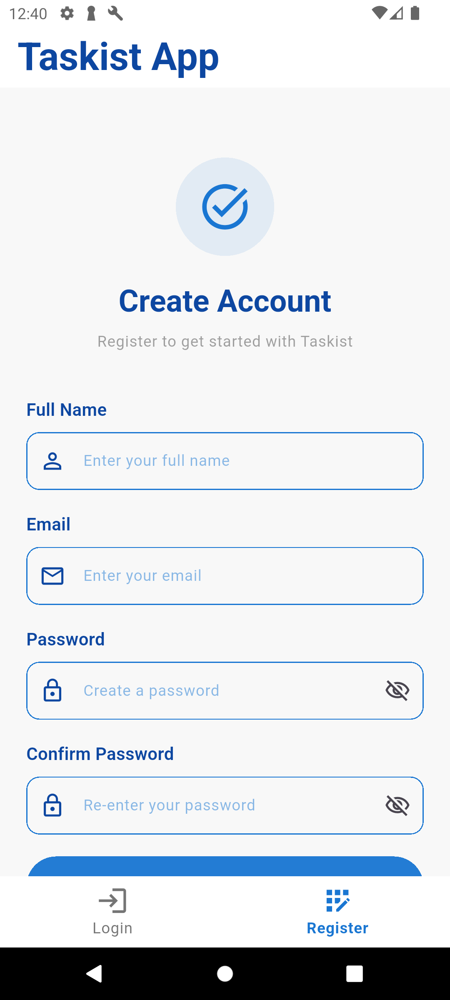
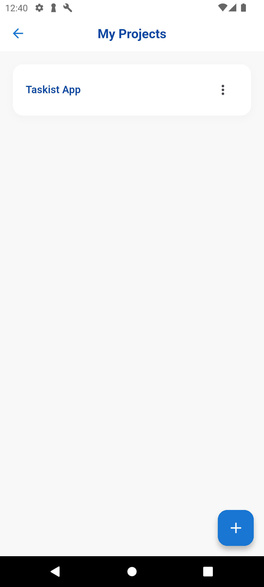
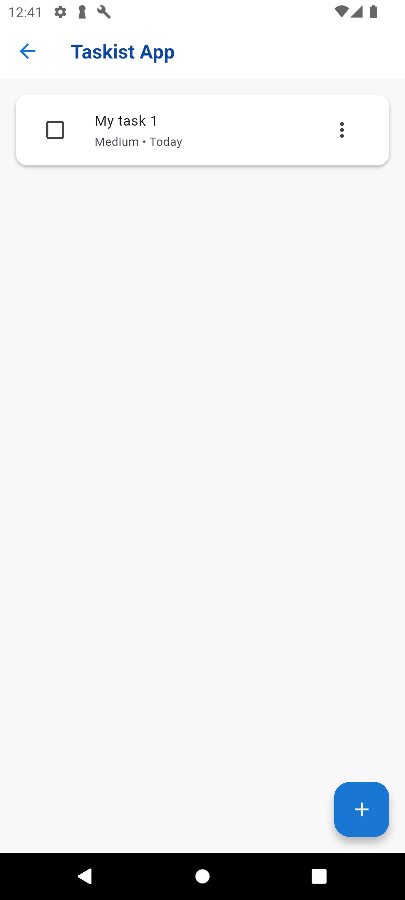
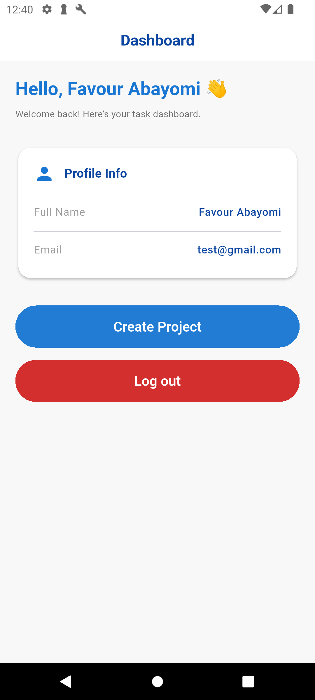

# 🚀 Taskist – Task Management App

A **clean, offline-first task management app** built with **Flutter**, featuring user authentication, project & task management, and a scalable MVVM architecture.  

> "Organize your work, one task at a time."

📱 **Cross-platform** | 💾 **Offline support** | 🔐 **User isolation** | 🧱 **Hive + Provider**

---

## 🎥 Demo

See the app in action:  

[Watch the demo video](assets/taskist_demo.mp4)
[Apk files](https://drive.google.com/drive/folders/1kUDieFoqAnE4wFnNW4eKZSy9lCP2LROE?usp=sharing)

---

## 📸 Screenshots

| Login | Register | Projects |
|-------|----------|----------|
|  |  |  |

| Task Page | Dashboard |
|-----------|-----------|
|  |  |

---

## 🛠️ Setup & Installation

### 1. Clone the repository
```bash
git clone https://github.com/ALGO1822/taskist_app.git
cd taskist_app
```

### 2. Install dependencies
```bash
flutter pub get
```

### 3. Generate Hive adapters (after model changes)
```bash
flutter pub run build_runner build
```

If you get errors, run:
```bash
flutter pub run build_runner build --delete-conflicting-outputs
```

### 4. Run the app
```bash
flutter run
```

✅ Works on **Android & Emulator**  
⚠️ **Web:** Limited Hive support → use mobile for full experience

---

## 🏗️ Architecture

This app follows **MVVM (Model–View–ViewModel)** with **Provider** for state management and **Hive** for local persistence.

### 🔑 Key Technologies
| Tech                    | Purpose                                |
| ----------------------- | -------------------------------------- |
| **Flutter**             | Cross-platform UI                      |
| **Hive**                | Fast, lightweight NoSQL local database |
| **Provider**            | State management                       |
| **shared_preferences**  | Session & user tracking                |
| **MVVM**                | Clean separation of logic and UI       |

---

## 🔐 Authentication

* Email & password login/register (offline simulation)
* User data stored in `shared_preferences`
* Session persistence across restarts
* User-specific project/task data via Hive

✅ 100% offline-first (no Firebase/backend needed)

---

## 📂 Projects & Tasks

### ✨ Features
* Create, rename, delete projects
* Add, edit, complete, delete tasks
* Task fields:
  * Title
  * Description
  * Priority (Low/Medium/High → color-coded)
  * Due Date (Today, Tomorrow, This Week, etc.)
* Offline-first with Hive
* Full CRUD with error handling

### 💾 Persistence
* All data stored locally with Hive
* Simulated API delay using `Future.delayed()`
* Safe read/write operations

---

## 🧪 Developer Tools

### 🔧 Clear All Data (Dev Mode)
* **Long-press** the app bar title on Home screen
* Calls `AuthService.clearAllData()`
  * Deletes all Hive data
  * Clears `shared_preferences`
  * Returns to login

Perfect for testing multi-user scenarios 🚀

---

## 🤖 Mock AI (Not Implemented Yet)


## 🙌 Credits

**Built by:** [Favour]  
📧 **Contact:** [tomisinabayomi2007@gmail.com](mailto:tomisinabayomi2007@gmail.com)  
💻 **GitHub:** [@ALGO1822](https://github.com/ALGO1822)
